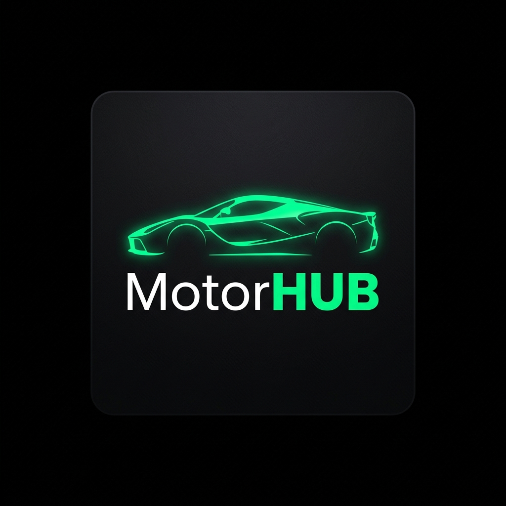

# MotorHub — Plataforma Integral para Concesionarias y Agencias Multirrubro

  
   
  <h2>Ecosistema Digital All-in-One para el Sector Automotor y Náutico</h2>
  
<strong>Autos • Camionetas • Camiones • Embarcaciones Náuticas • Motocicletas • Motorhomes</strong>

  

    
    
    
    
    
    
  

  

    
    
  

---

## 💎 Acerca de MotorHub

**MotorHub** es una solución digital de alto impacto diseñada para digitalizar, optimizar y potenciar las operaciones comerciales de concesionarias, agencias oficiales y salones multirrubro.

El sistema integra de forma nativa un **Showroom Público de Alta Gama** orientado a la conversión y captación de clientes con un **ERP / CRM Administrativo Centralizado** para el control del negocio en tiempo real.

---

## 🚀 Funcionalidades y Módulos del Sistema

### 🌐 Showroom Público (Experiencia del Comprador)
* **Diseño Luxury & Experiencia Inmersiva**: Catálogo visual con fotografías en alta resolución, peritaje técnico detallado y estado general de cada unidad.
* **Cotizador en Vivo de Divisas**: Barra de cotizaciones en tiempo real (*Dólar Blue, Oficial y MEP*) con conversión automática de precios.
* **Filtros Avanzados Multirrubro**: Búsqueda por categoría (`Automóviles`, `Motos`, `Camiones`, `Embarcaciones`, `Motorhomes`), marca, año, kilometraje, combustible, tracción y precio.
* **Comparador 1-a-1 de Unidades**: Comparación interactiva de especificaciones técnicas, motorización y equipamiento entre vehículos.
* **Módulo "Tasá tu Usado"**: Recepción de vehículos en parte de pago con carga de fotos, estado de carrocería y cálculo de tasación preliminar.
* **Folleto Comercial Imprimible (A4/PDF)**: Generación instantánea de fichas técnicas certificadas para entrega física a clientes en salón.
* **Simulador Financiero Prendario**: Cálculo automático de cuotas y planes de pago bajo sistema Francés de amortización.
* **Buscador de Sucursales y Casas Centrales**: Información de contacto, geolocalización y derivación directa a WhatsApp.

---

### ⚡ Integración con Mercado Libre (1-Clic VIS)
* **Publicación en 1 Solo Clic**: Exportación instantánea del inventario hacia Mercado Libre sin duplicar carga manual.
* **Mapeo Automático de Categorías Oficiales (MLA)**:
  * *Automóviles y Camionetas* $\rightarrow$ `MLA1743`
  * *Motocicletas* $\rightarrow$ `MLA1763`
  * *Camiones* $\rightarrow$ `MLA1744`
  * *Embarcaciones Náuticas* $\rightarrow$ `MLA1785`
  * *Motorhomes y Casas Rodantes* $\rightarrow$ `MLA1743`
* **Sincronización Multicanal**: Gestión de estados (publicaciones activas, pausadas o cerradas) y actualización automática de precios y fichas técnicas.

---

### 🏢 Panel de Control Administrativo (ERP / CRM)
* **Dashboard Analítico (Dueño)**: Métricas clave en tiempo real (Facturación mensual, ticket promedio, tasa de conversión, marcas líderes y rotación de stock).
* **Control de Rentabilidad y Margen Neto**: Registro de costos de compra y desglose de gastos de acondicionamiento (mecánica, chapa y pintura, estética, gestoría) para conocer el margen neto exacto por unidad.
* **Gestión de Stock y Fichas Técnicas**: Carga polimórfica de especificaciones por cada rubro vehicular.
* **Punto de Venta y Facturación**: Registro de operaciones y generación de **Boleto de Compraventa Oficial** con membrete institucional.
* **CRM de Consultas y Solicitudes**: Gestión y seguimiento de prospectos recibidos desde la web con derivación a vendedores.
* **Gestión de Empleados y Sucursales**: Administración de accesos, roles y puntos de venta.
* **Auditoría y Trazabilidad Forense**: Historial inmutable de cada acción realizada en el sistema con IP, usuario y timestamps.

---

## 👥 Matriz de Roles y Niveles de Acceso

| Módulo / Capacidad | 👑 Dueño / Administrador | 💼 Empleado / Asesor Comercial |
| :--- | :---: | :---: |
| **Showroom Público y Catálogo** | ✅ Total | ✅ Total |
| **Gestión de Stock e Inventario** | ✅ Total | ✅ Total |
| **Sincronización con Mercado Libre (1-Clic)** | ✅ Total | ✅ Total |
| **Gestión de Consultas y CRM** | ✅ Total | ✅ Total |
| **Registro de Ventas y Boleto Oficial** | ✅ Total | ✅ Total |
| **Módulo "Tasá tu Usado" / Permutas** | ✅ Total | ✅ Total |
| **Dashboard Analítico y KPIs Financieros** | ✅ Total | ❌ Restringido |
| **Costos de Compra y Margen de Ganancia** | ✅ Total | ❌ Restringido |
| **Gestión y Creación de Empleados** | ✅ Total | ❌ Restringido |
| **Gestión de Sucursales y Casas Centrales** | ✅ Total | ❌ Restringido |
| **Auditoría Forense y Logs de Seguridad** | ✅ Total | ❌ Restringido |

---

## 🔑 Acceso al Sistema y Credenciales Demo

Para acceder al Panel de Control y evaluar el sistema en vivo, ingresar a:
👉 **[motorhub-concesionaria.vercel.app/ingreso](https://motorhub-concesionaria.vercel.app/ingreso)**

| Perfil | Usuario | Contraseña | Permisos y Alcance |
| :--- | :--- | :--- | :--- |
| 👑 **Dueño / Admin** | `admin` | `admin123` | Acceso irrestricto a métricas financieras, auditoría, empleados y sucursales. |
| 💼 **Empleado** | `vendedor` | `vendedor123` | Acceso a operaciones comerciales, stock, ventas, CRM y Mercado Libre. |

---

## 🛠️ Stack Tecnológico

* **Frontend & Backend**: Next.js 16 (App Router) • React 19 • TypeScript
* **Diseño & Estilos**: Tailwind CSS 4 • Lucide Icons
* **Base de Datos & ORM**: PostgreSQL (Supabase) • Prisma ORM
* **Seguridad & Autenticación**: JWT con firma criptográfica (`jose` / `bcryptjs`)
* **Multimedia**: Cloudinary API para optimización y entrega de imágenes CDN
* **APIs Externas**: Mercado Libre API (OAuth 2.0 VIS) • Cotizaciones Dólar Argentina

---

## 📄 Créditos y Derechos Reservados

* **Desarrollo & Arquitectura de Software**: [Franco Loza](https://portfolio-francoloza.vercel.app/)
* **Licencia & Propiedad**: Este software ha sido diseñado y desarrollado como un producto integral para comercialización y uso profesional en el sector automotor. Prohibida su copia, distribución o reproducción no autorizada.

Todos los derechos reservados © MotorHub.
